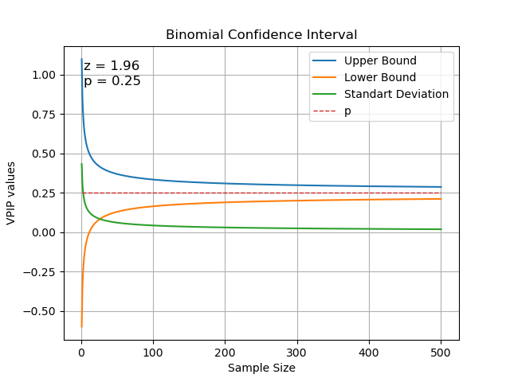

## Минимальный размер выборки для оценки VPIP/PFR

##### Задача: какой размер выборки нужен, для того, чтобы считать VPIP осмысленной статистикой?

VPIP - случайная величина, характеризующая отношение входов в игру к количеству игр. Считаю её дискретной.
#### Пробуем об нормальное распределение:
##### [Матожидание](Expected_Value): $$E(X) = \sum_{i=1}^{n} x_i \cdot p_i$$
- $Е(X)$ - математическое ожидание, выражено, как среднее взвешенное значение
- $n$ - верхний предел
- $i=1$ - начиная с первого элемента
- $Σ$ - знак суммы числового ряда
- $p$ - вероятность

Попробуем на искусственной выборке:

ряд: 1 - 5шт, 0 - 15шт
```
Е(X) = 1*(5/20) + 0*(15/20) = 0.25
```
##### [Дисперсия](Variance): $$var_{s} = \frac{\sum_{i=1}^{n}(x_{i}-\bar{x_{s}})^2}{n} $$
```
(((1-0.25)**2)*5 + ((0-0.25)**2)*15)/20 = 0.1875
```
##### [Cтандартное отклонение](Standard_Deviation): 
```
0,1875**(1/2) ≈ 0.433
```
То есть:

68% - впип чувака между -0.183 и 0.683, ежели это нормальное распределение. Что дичь.

#### Пробуем об биноминальное распределен![[VPIP_25_binominal.png]]ие.
Нам потребуется:
- точечная оценка вероятности входа в игру: 5/20
- [доверительный интервал](Confidence_Interval) для пропорции: 
$$\hat{p} \pm z \cdot \sqrt{\frac{\hat{p} (1 - \hat{p})}{n}}$$где $\sqrt{\frac{\hat{p} (1 - \hat{p})}{n}}$ ни что иное, как среднеквадратичное отклонение. Оно же стандартное.


берём z для 95%-го интервала (как это работает?): 1.97
```
5/20 +/- 1,96 * (5/20(1-5/20)/20)**(1/2)
(5/20(1-5/20)/20) = 0.009375
0.009375**(1/2) ≈ 0.097
1,96 * 0.097 ≈ 0.19
```
  
```
0.25 - 0.19 = 0.06
0.25 + 0.19 = 0.44
```

Крч, 20 - это мало :D

…а если 40, а пропорция та же?
```
0.25 - 0.14 = 0.11
0.25 + 0.14 = 0.39
```
  
Лучшéе, но всё ещё многа. 80?
```
0.25 - 0.1 = 0.15
0.25 + 0.1 = 0.35
```
  

С 95% чувак либо псих, либо нит!

Тут мне надоело, и я пошёл в питон. Он показывает, что для того, чтобы разброс значений сузился хотя бы до 5%, нужно наблюдений этак 400, и от пропорции оно не зависит.

